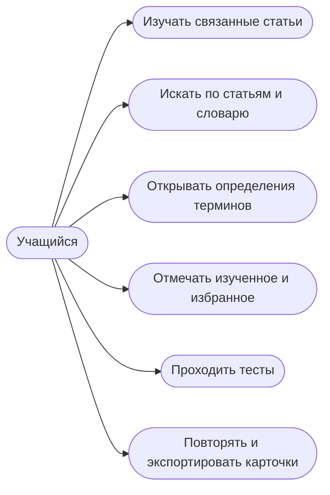

# Пользовательские сценарии

| Сценарий | Действие | Описание | Реализация |
|---|---|---|---|
| Изучение статьи | Открыть страницу | Читать материал и переходить по внутренним ссылкам | `app/WikiApp.tsx` |
| Полнотекстовый поиск | Ввести запрос в верхней строке | Найти статью или термин по названию и содержанию | `app/WikiApp.tsx` |
| Словарь | Нажать на термин или кнопку «Словарь» | Посмотреть краткое и расширенное определение | `app/WikiApp.tsx` |
| Избранное и прогресс | Нажать звезду или «Отметить изученным» | Сохранить состояние в браузере | `app/WikiApp.tsx` |
| Самопроверка | Ответить на три вопроса | Получить результат и пояснения | `app/WikiApp.tsx` |
| Карточки | Открыть раздел или экспортировать TSV | Повторить термины на сайте или перенести их в Anki | `app/WikiApp.tsx` |
